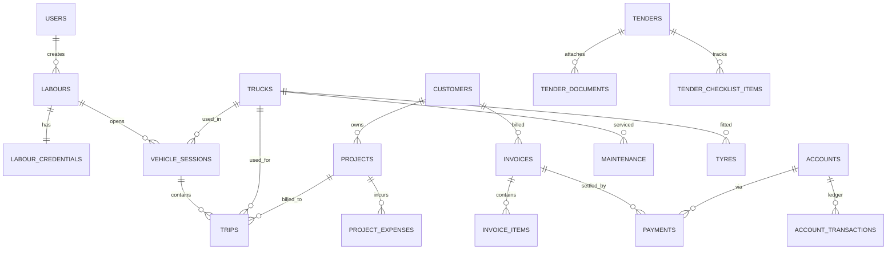

# Database

Source of truth: `supabase/migrations/*.sql`, applied in numeric order.
This document explains the design; it does not restate every column.

- `0001_init.sql` — all tables, enums, constraints, indexes.
- `0002_permissions_seed.sql` — permission catalogue + default role grants.
- `0003_rls.sql` — Row Level Security policies.

## Conventions

- Primary keys: `uuid default gen_random_uuid()`.
- Every table has `created_at`; mutable tables have `updated_at` maintained
  by the `set_updated_at()` trigger.
- Soft deletion (`deleted_at timestamptz`) is used for records that can be
  referenced historically after removal (users, labours, trucks, customers,
  vendors, projects, tenders, invoices, documents) — never hard-deleted, so
  historical trips/invoices/sessions keep valid references.
- Money columns are `numeric(12,2)` / `numeric(14,2)` — never floating point.
- Enumerated states use Postgres `enum` types, not free-text status columns,
  so invalid states are rejected at the database layer.

## Entity groups

## `vehicle_sessions` — the truck-of-the-day mechanism

This table is the answer to "labour has no permanent truck" (section 1.4 of
the spec). A labour never has a `truck_id` column on their own record.
Instead:

1. Labour logs in (Labour ID + Login Key).
2. Server queries trucks with `status = 'ACTIVE'` and no currently `OPEN`
   vehicle session (`uq_one_open_session_per_truck` enforces this at the DB
   level, so two labours can never be handed the same truck concurrently).
3. Labour picks a truck; server inserts a `vehicle_sessions` row with
   `status = 'OPEN'` and the truck's current odometer as `opening_odometer`.
   `uq_one_open_session_per_labour` prevents one labour from having two
   concurrent sessions.
4. All trips/fuel entries logged during the shift reference that
   `vehicle_session_id`, so history is permanently attached to the truck that
   was actually used that day — even though the labour drives a different
   truck tomorrow.
5. Session closes (`status = 'CLOSED'`) when the labour ends their shift and
   enters a closing odometer, or `FORCE_CLOSED` by an admin for exceptions
   (`closed_by` records who did that).

This is the only place "which truck is this labour using" is decided —
Admin does not perform manual daily truck assignment.

## `trips` — no GPS

`distance_km` is a **generated column**: `ending_odometer - starting_odometer`,
computed by Postgres, never trusted from client input. There is no lat/lng,
route, or geofence column anywhere in the schema, by design.

## Money flow

`invoices` → `invoice_items` (line items, generated `line_total`) →
`payments` (direction `CREDIT` for customer receipts, `DEBIT` for vendor
payouts) → `account_transactions` (the actual cash/bank/UPI ledger entry,
one per payment, `balance_after` computed by application logic at insert
time — kept as a plain column rather than a second generated computation so
historical balances stay stable even if the account's opening balance is
later corrected).

## Documents

Rather than a `truck_documents`/`driver_documents`/`tender_documents` table
per owner type only, there is also a generic `documents` table keyed by
`(owner_type, owner_id)` for anything that doesn't need owner-specific
columns (customer/vendor/project/invoice/user attachments). Truck and driver
documents got their own tables because they carry a meaningful
`expiry_date` that reporting queries filter on directly (RC, insurance,
permit, fitness, licence expiry reminders).

## Indexing strategy

- Foreign keys used in list/filter screens are indexed (`truck_id`,
  `labour_id`, `project_id`, `status`, etc.).
- Partial indexes (`where deleted_at is null`, `where status = 'OPEN'`,
  `where is_read = false`) keep the common-case index small as data grows
  well past 150 trucks.
- `uq_one_open_session_per_truck` / `uq_one_open_session_per_labour` are
  partial unique indexes doubling as business-rule constraints, not just
  performance indexes.

## RLS

See [RBAC.md](RBAC.md) for the full authorization model. In short: Postgres
RLS (migration `0003_rls.sql`) is defense-in-depth for the admin/staff
surface (which authenticates via Supabase Auth, so `auth.uid()` is
populated). Labour requests are served by server-only API routes using the
service role key and are authorized in application code instead, because
labour accounts do not have Supabase Auth sessions.
